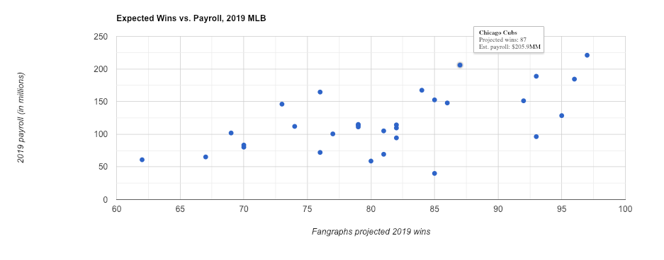

# Payroll vs. Expected Wins for 2019 MLB Season
My goal here was to compare the amount of money Major League Baseball's 30 teams have committed to their 2019 payrolls to the number of games they're expected to win in the upcoming MLB season. The win projections came from [baseball research site Fangraphs](https://www.fangraphs.com/depthcharts.aspx?position=Standings), while the payroll figures were taken from [Spotrac's MLB Team Payroll Tracker](https://www.spotrac.com/mlb/payroll/). Numbers are accurate as of January 24, 2019.

## Methodology

I'm a big baseball fan and frequent user of Fangraphs. It's pretty well established that teams that spend more money win more games. However, as with anything, there are outliers, and I was curious where those outliers might be heading into the upcoming season.

The major flaw in doing this is the timing. It's the middle of the offseason, and a number of consequential players haven't signed contracts for the upcoming season. The signings of superstars like [Bryce Harper](https://www.baseball-reference.com/players/h/harpebr03.shtml) and [Manny Machado](https://www.baseball-reference.com/players/m/machama01.shtml), just to name two, will significantly affect both the payrolls and win projections of the teams with whom they choose to sign, not to mention any trades to come or signings of the dozens of other players who remain free agents.

Getting the information was fairly straightforward. The Fangraphs win projections are linked on the site's front page, and current payroll data turned out to be a Google search away. I downloaded both tables as CSVs using Google Sheets' `importHTML` function. You can find both raw files in this repo.

## Execution

The [Google Charts documentation](https://developers.google.com/chart/interactive/docs/) is fairly robust and made implementing the visualization fairly straighforward once I'd input the data. The vertical axis shows each team's payroll, while the horizontal access indicates projected wins.

One wrinkle was creating the custom HTML that appears in the tooltip content. On mouseover of each data point, a tooltip box pops up showing the team name, projected wins, and payroll for that specific data point. Those could be edited to include a team logo in a future iteration, if desired.

[Click here](https://mlb2019.herokuapp.com/) to view the interactive version of the chart, or see example screenshot below.

## Conclusion

As mentioned at the outset, the goal was to find outliers. Teams like Boston (97 wins with a $221 million payroll) and Baltimore (60 wins for $60.9 million) fit the trend that we would've expected when we started.

Teams that jumped out to me included Cleveland (93 wins, $96.3 million), a team whose ownership invests less in the on-field product but has been a perennial playoff team in recent years through drafting and developing young stars with smaller salaries. This is even more true for the Tampa Bay Rays, who sport the game's smallest payroll at $40 million but are projected to finish with a record above .500.

The flip side of that - teams spending a lot of money but expected to receive very little in return - include the San Francisco Giants (76 expected win from a payroll of $164.6 million) and Seattle Mariners (73 wins for $146.1 million).

## What's Next?

There are so many directions you could go with this. Compare last year's wins to this year's projections to see who has improved. Compare last year's payrolls to this year's to see whose owner is tightening the belt. Create a ratio of dollars per win expected for this year and see how it compares to where the team finished last year. They're all fun.
